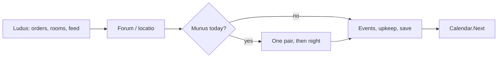
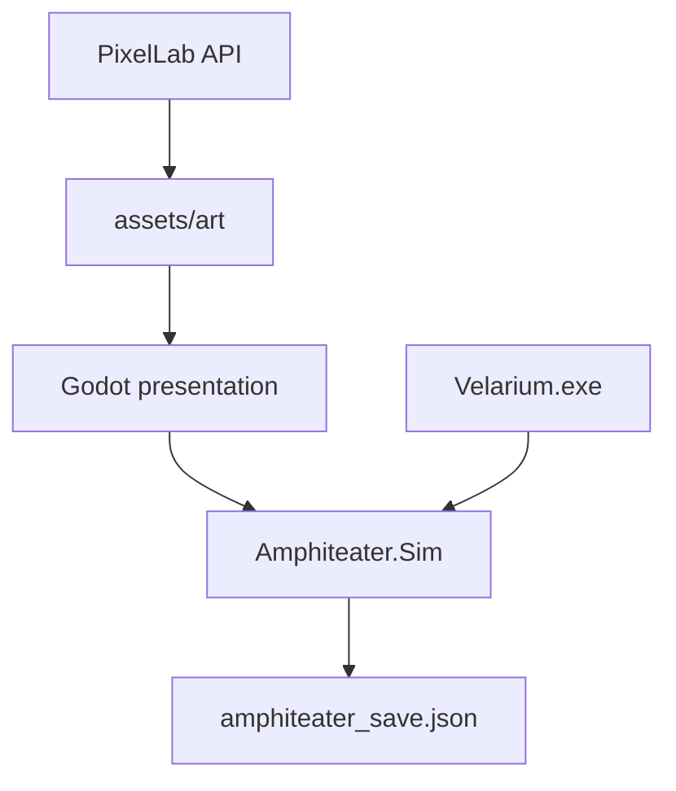

# Amphiteater — Expansion Design

**Status:** Draft (PR1 + PR1.5 landed 2026-08-28/29; M2 household/night ops specified)  
**Date:** 2026-08-26; revised 2026-08-29  
**Audience:** the implementer (us) and a future reader who has not seen the chat  
**Citations:** only `docs/research/ludus_sources.md`. Anything else is **Gameplay concession**.

---

## Overview

M1 is a playable C# console lanista slice: Capua, day-turns, locatio, Gaius-style purses, hosting locked. This document is how that slice becomes a **turn-based gladiator management simulator and ludus base-builder** without dropping history for spectacle or spectacle for homework.

The player stays a **lanista**. The map is a **courtyard with cells**, not Rome. Combat stays **sim-resolved**. Presentation moves to **Godot 4 (C#)** with **PixelLab** pixel art. The console host remains as headless/debug so the exe never goes dark.

---

## Background

`src/Velarium` already has the fantasy that should not be redesigned: *infamia*, hire-vs-sale of men, four *armaturae*, Roman civil dates, JSON save. What it lacks is a **place** (the ludus as a building) and a **body** (diet, crowding, medicus as rooms). Expanding those as menus would stay honest and stay ugly. Expanding them as a courtyard is the same sim with a face.

Decision `production/decisions/001_console_ludus.md` said no engine switch until the loop was playable. The loop exists. This doc is the switch.

---

## Goals

- One **day = one turn**, three layers: ludus / forum / harena.
- Base-building = **unlocking rooms on a historically attested courtyard plan**.
- Economy remains Gaius 3.146 in **ratio** (sweat cheap, corpse dear).
- Lethality in the early Principate band (Ville ~10% of combatants per bout).
- Honest grit: slavery, death, maiming, infamia. No sexual violence as a player action. No children as fighters.
- Godot 4 C# presents; `Amphiteater.Sim` decides.
- PixelLab produces tiles and *armatura* sprites from a locked style sheet. API token never in git.

## Non-goals

- Open-world Rome, player-as-gladiator action, real-time combat.
- Starting in the Ludus Magnus or as an imperial procurator.
- Gladiatrices as default roster.
- Applying the senatus consultum of 177 CE as year-one law.
- Torture minigames, sexual content as a verb, child *damnati* as playable stock.

---

## Proposed design

### Fantasy

You own a *familia gladiatoria* in Capua. The courtyard is a palaestra and a prison. Magistrates hire your men. The curia will not have you. If the ludus earns *fama*, you may *edere munus* for an afternoon — *mitte* or *iugula* in your hand, not a magistrate’s.

### Frame

| | |
|---|---|
| Place | Capua / Campania (Puteoli, Nola, Pompeii, Neapolis). Rome is a late shadow. |
| Time | a.u.c. DCCLXXXII (29 CE, Tiberius). Augustus’s *sine missione* ban is in force (Suet. *Aug.* 45). |
| Player | Lanista, *infamis*. Tria nomina. |
| Stock | *Servi*, *auctorati* (Petronius *Sat.* 117), rare *damnati*. |

### Truth vs concession

| Topic | History | Game | Label |
|---|---|---|---|
| Fight frequency | A career is tens of fights over years (Flamma ILS 5113: 34 in a lifetime). | Locatio often enough that a week of play has sand. Flavor: Campania is greedy for shows. | **Concession** |
| Lethality | Ville 1981: ~19 dead / 100 bouts in the 1st c. (~10% of men). Missio is normal. | Target ~10% death per combatant per fight. Stars get missio more often (epitaphs). | **Align to Ville** |
| Gaius 20 / 1000 | Real contract type. | Keep the **ratio**. Scale so 1,000 does not one-shot a 620-denarii start. | **Ratio true, numbers tuned** |
| Diet | Pliny *NH* 18.14 *hordearii*; Lösch 2014 C3 + legumes + high Sr/Ca; Pliny *NH* 36.203 ash drink. | Kitchen level → vigor. Ash-drink = medicus upgrade. | **True** (diet type; Ephesus is later/east) |
| Cells | Jacobelli: ~10–15 m², 2–3 men, straw, two storeys. | Roster cap = cell beds. Overcrowd / mix types → Juvenal quarrels, fever. | **True** |
| Layout | Courtyard + portico cells, one gate (Bomgardner). | Builder unlocks rooms on that plan. No towers. | **True** |
| Ludus Magnus | Domitianic, Rome. | Late-game image, not the start map. | **Time-gate** |
| Palus ranks | Epitaphs; Carter 2003. | Titles from record. SC 177 prices stay out of year 1. | **Ranks true, SC late** |
| Infamia | Lanista ≈ butcher in elite mouths. | No office. Fama buys contracts, not dinner. | **True** |
| *Rudis* | Discharge, *rudiarii*. | Late, costly, fama-positive; you lose the asset. | **True, rare** |
| Women / children | Rare gladiatrices; Pompeii guest in a cell. *Damnati* could include the young. | No default gladiatrices. **No child fighters.** | **Omission** |
| Sexual violence | Part of slavery. | Not a player verb. | **Omission** |
| Pixel art | Anachronistic medium. | Kit from Pompeii finds, not Hollywood cuirasses. | **Medium concession** |
| Calendar | Real civil dates (M1). | Keep dates; compress festival density. | **Dates true, density concession** |

### Turn structure

Keep M1: **one day = one turn**.



No separate combat game. The harena is a staged resolution of `Combat.Fight` (`src/Amphiteater.Sim/Combat.cs`). Day rules live in `Ludus` (`src/Amphiteater.Sim/Ludus.cs`); the console is a host.

### Base = the ludus plan

Start (small Capuan ludus): porta, palus in a dirt yard, 3–4 *cellae*, kitchen hearth.

| Room | Evidence | Play effect |
|---|---|---|
| *Cellae* | Jacobelli / Bomgardner | +2–3 beds each. Straw. |
| Second storey | Pompeii two-level cells | Density vs unrest |
| Kitchen / mess | Barracks dining | Diet quality (barley/beans) |
| Armamentarium | Helmets, greaves, *galerus* | Gear by *armatura*; wrong kit = crowd penalty |
| Medicus / sick cells | Imperial *saniarium* as analogue; Galen as *method* | Heal rate; ash-drink upgrade |
| Training ellipse | Ludus Magnus (late analogue) | Sparring without locatio |
| Watch / porta | Single guarded entrance | Escape / Spartacus-memory events |

**Layout constraint:** cells open onto a portico around a courtyard. PixelLab tilesets must match. This is not SimCity.

**M2 (console, before Godot):** rooms are a menu. Unlock/upgrade costs denarii and a worker-day. Kitchen/medicus/porta bonuses apply only if a **household slave** is assigned. Gladiators do not cook.

### Household slaves (M2)

Separate stock from the familia gladiatoria. Bought cheap at the forum. Cannot fight, take a palma, or go on locatio. Lower upkeep than a gladiator. Assign 1:1 to a room. Idle mouths still eat.

### Night ops vs a rival camp (M2)

One named rival at Start (already flavor in `Content.RivalLanistae`). Night is a **choice**: Rest (current RNG), Spy, Poison (foe enters `Vulneratus` — Gameplay concession: wine at the gate), Sabotage (rival misses a day / fama hit). Default actor: a household slave. A gladiator is allowed, higher success, you may lose the asset. Caught: fine, hostility, or the agent does not return. Grit line unchanged: no sexual violence, no child fighters.

### Familia and body

Keep M1 fields: *armatura*, vigor, virtus, palmae, stantes, missiones, pugnat, status. Add:

- **Beds** vs living count (overcrowd).
- **Diet tier** (kitchen): vigor regen, injury chance.
- **Rank title:** tiro / veteranus / primus palus from record (Carter), not from the 177 price table.
- **Pairings:** murmillo–thraex, retiarius–secutor first (Coleman / standard matchups). Hoplomachus later.

Stock sources: *servus* (forum), *auctoratus* (oath text from Petronius), *damnatus* (cheap, high escape and iugula risk).

### Economy

Gaius 3.146 remains the contract: small *pro sudore* if *integer*, large if *occisus* or *debilitatus*. Tune the **ratio** (~1:50 in the text) to starting purse so death is a cash spike that still costs the asset.

Upkeep: mouths × diet + roof. Hosting a munus: cash sink, fama spike, you are *editor* (already sketched in `Game.HostScreen`).

Do not import SC 177 sesterce tables into year 1.

### Spectacle and society

Locatio first (M1). Hosted munus when fama + a palma exist. Crowd shouts *mitte* / *iugula*; we do not encode pollice verso as fact.

*Infamia* is a locked door, not a meter you fill to become consul. Duumviri and aediles appear as employers (`Content.EditorOffices`). Rival lanistae = competing familiae on the same circuit.

### Architecture

```
src/Amphiteater.Sim     # extract from src/Velarium: Models, Combat, Content, Calendar, GameState, Save DTO
src/Velarium            # console host calling the sim (keep runnable)
godot/                  # Godot 4 C# : ludus view, UI, combat staging
assets/art/             # PixelLab PNG + STYLE.md + prompt/seed log
```



Sim owns denarii, rooms, familia, combat math. Godot owns camera, clicks, sprites. Same JSON save.

### PixelLab

- Token: `PIXELLAB_API_TOKEN` in gitignored `.env`. Never in repo or chat.
- API: `https://api.pixellab.ai/v2` (Pixflux / style-reference / tiles / characters).
- **Style lock:** NES / SNES chunky pixels (`assets/art/STYLE.md`). Pompeii kit, cartoon KO. Not painterly, not isometric.
- Log: `assets/art/prompts/` next to each PNG (prompt, size, seed, endpoint).
- **Map:** `assets/art/ASSET_MAP.md` — waves, frame counts, PixelLab endpoints. Generate only after wave 0 lock.

### Security

- Secrets only in `.env` / user environment.
- No network from the game at runtime. PixelLab is an **offline pipeline**, not a live dependency.
- Grit policy is a content rating, not a legal module: document it in About.

### Rollout

Console stays the integration test. Each Godot PR must still `dotnet build src/Velarium`. If Godot is broken, the sim still runs.

---

## Alternatives considered

| Option | Why not |
|---|---|
| Stay console, buildings as menus | Honest, cheap, no PixelLab. Rejected: user wants a base-builder with pixel art. |
| Godot GDScript | Splits language from the sim. C# keeps one brain. |
| Unity | Heavier, worse 2D pixel default, license noise. |
| Full Colosseum start | Wrong role (you are not the emperor’s procurator) and wrong date for Ludus Magnus. |
| Hollywood lethality (every bout a death) | Contradicts Ville + Gaius (a corpse costs fifty sweats). Unplayable as a roster game. |
| Unvarnished sexual violence / child *damnati* | History contains it; playability and the grit line forbid it as a verb. |

---

## Key Decisions

1. **Godot 4 + C#** over console-only or Unity — courtyard needs a view; sim stays C#.
2. **Courtyard-constrained builder** over freeform city — Jacobelli/Bomgardner plan.
3. **Day-turn retained** — M1 loop is the game; graphics dress it.
4. **Gaius ratio, tuned numbers** — law as design, not as a 20-denarii table that starves the start purse.
5. **Ville 1st-c. lethality** — missio is the norm in 29 CE (Suet. *Aug.* 45).
6. **Honest-but-playable grit** — slavery and death stay; rape and child fighters do not.
7. **Capua-first** — Ludus Magnus and SC 177 are late.
8. **PixelLab as offline pipeline** — style sheet + logged prompts; no runtime API.
9. **Extract Sim before Godot** — console never goes dark.

---

## Open Questions

1. Isometric vs 3/4 top-down for the courtyard? (PixelLab supports both; pick one style sheet.)
2. Exact Gaius ratio after tuning (start 620 denarii; 3 mouths; 28/day upkeep in M1).
3. Whether a second storey is a visual layer in Godot M2 or a stat-only unlock.

---

## References

All citations: `docs/research/ludus_sources.md`.  
M1/PR1.5 code: `src/Amphiteater.Sim/` (`Ludus.cs`, `Combat.cs`, `Models.cs`, …); host `src/Velarium/Game.cs`.  
Prior law: `production/decisions/001_console_ludus.md`, `docs/design/00_overview_stub.md`.

---

## PR Plan

Each PR is independently playable. Console build is required on all of them.

### PR1 — Extract Amphiteater.Sim
- **Depends on:** none
- **Status:** done 2026-08-28
- **Files:** `src/Amphiteater.Sim/`; `src/Velarium` is a host
- **What:** Models, Combat, Content, Calendar, GameState, Save DTO.

### PR1.5 — Ludus rules + `--report`
- **Depends on:** PR1
- **Status:** done 2026-08-29
- **Files:** `Ludus.cs`, `CareerSim.cs`; Game.cs UI-only; `Amphiteater.Sim.Tests`
- **What:** Start / locatio / EndDay in Sim. Headless Ville/Gaius report. No new verbs.

### PR1.6 — M2 rooms, household, night ops (console)
- **Depends on:** PR1.5
- **Status:** done 2026-08-29
- **Files:** Sim room/worker/rival models; forum + ludus + night menus in Velarium
- **What:** Unlock/upgrade rooms; assign household slaves; spy/poison/sabotage vs one rival. Still no Godot.

### PR2 — Godot 4 C# shell
- **Depends on:** PR1
- **Files:** `godot/` project, `.gitignore` for `.godot/`
- **What:** Empty courtyard scene, End Day button, load/save same JSON. No new systems.

### PR3 — PixelLab style sheet + first tileset
- **Depends on:** PR2
- **Files:** `assets/art/STYLE.md`, courtyard/cell/palus/porta PNGs, prompt logs
- **What:** Locked palette. Godot shows the empty ludus with real tiles. Token via `.env` only.

### PR4 — Rooms as data + visible cells
- **Depends on:** PR1, PR3
- **Files:** Sim room model; Godot cell sprites
- **What:** Cell count = roster cap. Kitchen and medicus as rooms with M1 medicus/forum effects. Overcrowd events (Juvenal).

### PR5 — Familia on the courtyard
- **Depends on:** PR4
- **Files:** four *armatura* idles; inspect pane = M1 familia screen
- **What:** Click a man in a cell. Orders (palus / rudes / requies) from the yard.

### PR6 — Locatio + staged combat
- **Depends on:** PR5
- **Files:** Godot harena scene wrapping `Combat.Fight`
- **What:** Same math as M1. Present beats; *mitte* / *iugula*. Tune death toward Ville ~10%.

### PR7 — Hosted munus as editor
- **Depends on:** PR6
- **What:** Unlock already in M1 (`HostingUnlocked`). Godot presents the edictum and your hand on the fallen.

### PR8 — Diet / stores
- **Depends on:** PR4
- **What:** Barley/oil stores; kitchen tier; Pliny/Lösch diet as vigor, not a cooking minigame.

### PR9 — Rivals and Campanian circuit
- **Depends on:** PR6
- **What:** Named rival familia; venues already in `Content.Venues`.

### PR10 — Rudis and late image of Rome
- **Depends on:** PR7–PR9
- **What:** Discharge as a rare, costly, fama-positive loss of an asset. Ludus Magnus as a *picture*, not a start map.
